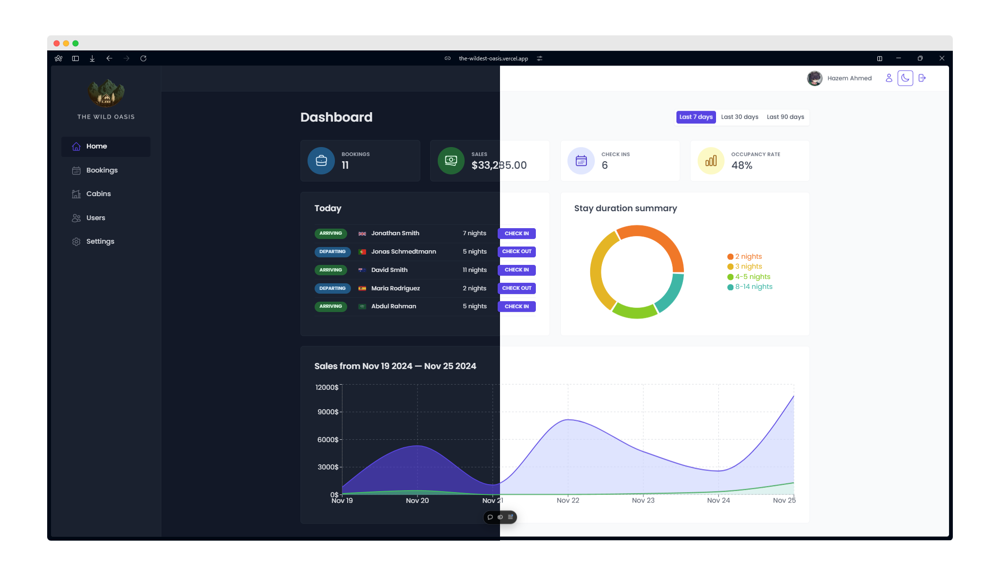

  

  <h1>The Wild Oasis - Admin</h1>

  <h3>
    <a href="https://the-wildest-oasis.vercel.app">
      <strong>Live Site</strong>
    </a>
  </h3>

  

    <a href="https://the-wildest-oasis.vercel.app">View website</a>
    •
    <a href="https://github.com/CodeWithAlamin/The-Wild-Oasis/issues">Report Bug</a>
    •
    <a href="https://github.com/CodeWithAlamin/The-Wild-Oasis/pulls">Request Feature</a>
  

  

<!-- Badges -->

<!-- Brief -->

Welcome to <b>The Wild Oasis</b>! This is a hotel management web app, where hotel employees can manage cabins, bookings, and guests. It uses Supabase as the backend and implements advanced React techniques such as HOCs and React Query.

<!-- Screenshot -->

## Live Site

Check out the live admin app here: [The Wild Oasis](https://the-wildest-oasis.vercel.app)

## Key Features

### Authentication

- Users of the app are hotel employees. They need to be logged into the application to perform tasks
- New users can only be signed up inside the applications (to guarantee that only actual hotel employees can get accounts)
- Users should be able to upload an avatar, and change their name and password

### Cabins

- App needs a table view with all cabins, showing the cabin photo, name, capacity, price, and current discount
- Users should be able to update or delete a cabin, and to create new cabins (including uploading a photo)

### Bookings

- App needs a table View With all bookings, showing arrival and departure dates, status, and paid amount, as well as cabin and guest data
- The booking status can be -unconfirmed" (booked but not yet checked in), -checked in", or "checked out-. The table should be filterable by this important status
- Other booking data includes: number of guests, number of nights, guest observations, whether they booked breakfast, breakfast price

### Check in / out

- Users should be able to delete, check in, or check out a booking as the guest arrives (no editing necessary for now)
- Bookings may not have been paid yet on guest arrival. Therefore, on check in, users need to accept payment (outside the app). and then confirm that payment has been received (inside the app)
- On check in, the guest should have the ability to add breakfast for the entire stay, if they hadn't already

### Guests

- Guest data should contain: full name, email, national It), nationality, and a country flag for easy identification

### Dashboard

- The initial app screen should be a dashboard, to display important information for the last 7, 30, or 90 days:

  - A list of guests checking in and out on the current day. Users should be able to perform these tasks from here
  - Statistics on recent bookings, sales, check ins, and occupancy rate
  - A chart showing all daily hotel sales, showing both -total" sales and "extras" sales (only breakfast at the moment)
  - A chart showing statistics on stay durations, as this is an important metric for the hotel

### Settings

- Users should be able to define a few application-wide settings: breakfast price, min and max nights/booking, max guests/booking
- App needs dark mode

## Technologies Used

- **React** for the frontend.
- **Supabase** for the database and real-time data updates.
- **React Query** for data fetching and caching.
- **React Router** for navigation.
- **React Hook Form** for efficient form handling.
- **Recharts** for data visualization (charts and stats).
- **Styled Components** for styling the UI, including dark mode.
- **Vite** for development environment and build system.

## What I Learned

This project was a deep dive into several advanced React concepts, including:

- **Authentication and Authorization:** Implementing Supabase to securely manage user roles (hotel employees).
- **Real-time Functionality:** Leveraging Supabase's real-time features for dynamic data updates.
- **State Management and Data Fetching:** Using React Query to efficiently manage the app's data flow.
- **Complex UI Patterns:** Implementing reusable patterns like the Compound Component Pattern and Higher-Order Components (HOC) to create more maintainable and scalable code.
- **Responsive and Adaptive Design:** Building a responsive user interface using Styled Components, making sure it works well on different devices and screen sizes.
- **Dark Mode:** Adding dark mode functionality for a personalized user experience.
- **Data Visualization:** Using Recharts to create meaningful visual representations of hotel statistics.

## Acknowledgments

This app was developed as part of the [Udemy course](https://www.udemy.com/course/the-ultimate-react-course) by **Jonas Schmedtmann**. Special thanks to Jonas for his excellent teaching and guidance throughout the course.
